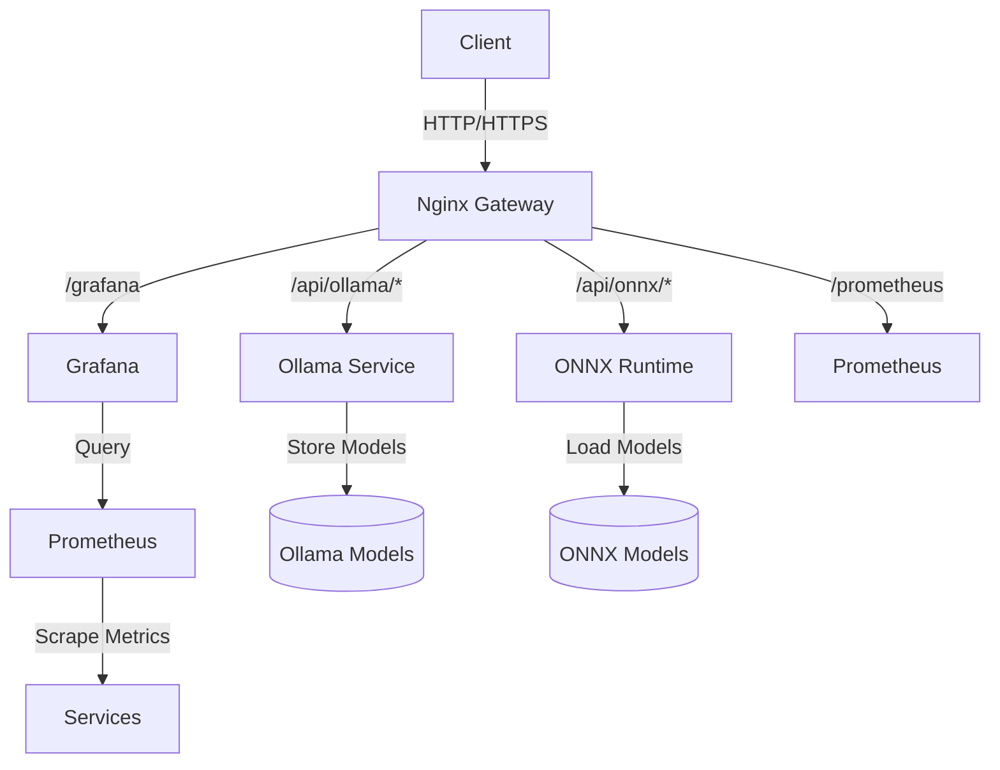

```
 _____      _      _____    ___   
 | ____|    / \    |_   _|  / _ \  
 |  _|     / _ \     | |   | | | | 
 | |___   / ___ \    | |   | |_| | 
 |_____| /_/   \_\   |_|    \___/  
  ___    _   _   _   _   _   _   _ 
 |_ _|  / \ | | | \ | | | | | | | |
  | |  / _ \| | |  \| | | | | | | |
  | | / ___ \ |_| |\  | |_| | |_| |
 |___/_/   \_\___/|_| \_|\___/ \___/ 
```
# Edge AI Platform

A comprehensive Edge AI platform with LLM (Ollama) and ML (ONNX Runtime) serving capabilities, monitoring, and more.

## 📚 Documentation

- [📖 Overview](/docs/overview.md)
- [🚀 Quick Start](#-quick-start)
- [📊 Architecture](#-architecture)
- [🔧 Services](#-services)
- [📈 Monitoring](#-monitoring)
- [🔍 Examples](/docs/examples/)
  - [Ollama LLM](/docs/examples/ollama-basic.md)
  - [ONNX Runtime](/docs/examples/onnx-basic.md)
- [🧩 API Reference](#api-reference)
- [🧪 Testing](#-testing)
- [🧹 Cleanup](#-cleanup)

## 🚀 Quick Start

### Prerequisites

- Docker and Docker Compose
- Python 3.8+ (for running tests and examples)
- At least 8GB RAM (16GB recommended for running LLMs)
- `curl` and `jq` (for testing and examples)

### Starting the Platform

1. Clone the repository:
   ```bash
   git clone https://github.com/wronai/edge.git
   cd edge
   ```

2. Start all services:
   ```bash
   docker-compose up -d
   ```

3. Verify services are running:
   ```bash
   docker-compose ps
   ```
   All services should show as "healthy" or "running".

4. Run the test suite to verify everything is working:
   ```bash
   ./test_services.sh
   ```

### Accessing Services

- **Ollama API**: http://localhost:11435
- **ONNX Runtime**: http://localhost:8001
- **Nginx Gateway**: http://localhost:30080
- **Grafana**: http://localhost:3007 (admin/admin)
- **Prometheus**: http://localhost:9090

### ONNX Runtime Management

```bash
# Check ONNX Runtime status
make onnx-status

# List available ONNX models
make onnx-models

# Load a new model
make onnx-load MODEL=model-name PATH=/path/to/model.onnx

# Test inference with a sample request
make onnx-test
```

For detailed ONNX Runtime documentation, see [docs/onnx-runtime.md](docs/onnx-runtime.md)

### Example: Using ONNX Runtime

Here's how to use the ONNX Runtime service for model inference:

1. **Check service health**:
   ```bash
   curl http://localhost:8001/health
   # Expected response: {"status": "OK"}
   ```

2. **List available models**:
   ```bash
   curl http://localhost:8001/v1/models
   # Example response: {"models": ["model1.onnx", "model2.onnx"]}
   ```

3. **Run inference** (using Python):
   ```python
   import requests
   import numpy as np
   
   # Sample input data (adjust based on your model's expected input)
   input_data = {
       "model_name": "wronai.onnx",
       "input": {
           "input_1": np.random.rand(1, 224, 224, 3).tolist()  # Example for image input
       }
   }
   
   # Send inference request
   response = requests.post(
       "http://localhost:8001/v1/models/your_model:predict",
       json=input_data
   )
   
   # Process the response
   if response.status_code == 200:
       predictions = response.json()
       print("Inference successful!")
       print(f"Predictions: {predictions}")
   else:
       print(f"Error: {response.status_code}")
       print(response.text)
   ```

4. **Using cURL for simple inference**:
   ```bash
   curl -X POST http://localhost:8001/v1/models/your_model:predict \
        -H "Content-Type: application/json" \
        -d '{"input": [[[0.1, 0.2, 0.3], [0.4, 0.5, 0.6]]]}'
   ```

For more advanced usage, refer to the [API Reference](docs/api-reference.md).

### Stopping the Platform

To stop all services:
```bash
docker-compose down
```

To remove all data (including models and metrics):
```bash
docker-compose down -v
```

## 🏗️ Architecture



## 🔧 Services

### Core Services

```
┌─────────────────┬──────────┬──────────────────────────────────────────┐
│ Service         │ Port     │ Description                              │
├─────────────────┼──────────┼──────────────────────────────────────────┤
│ Nginx Gateway   │ 30080    │ API Gateway and reverse proxy            │
│ Ollama          │ 11435    │ LLM serving (compatible with OpenAI API) │
│ ONNX Runtime    │ 8001     │ ML model inference                       │
│ Prometheus      │ 9090     │ Metrics collection and alerting          │
│ Grafana         │ 3007     │ Monitoring dashboards                    │
└─────────────────┴──────────┴──────────────────────────────────────────┘
```

## 📈 Monitoring

Access the monitoring dashboards:

- **Grafana**: http://localhost:3007 (admin/admin)
- **Prometheus**: http://localhost:9090
- **Ollama API**: http://localhost:11435
- **ONNX Runtime**: http://localhost:8001

## 🧪 Testing

### Running Tests

We provide test scripts to verify all services are functioning correctly:

1. **Basic Service Tests** - Verifies all core services are running and accessible:
   ```bash
   # Run all tests
   make test
   
   # Or run individual tests
   ./test_services.sh
   ```

2. **ONNX Runtime Tests** - Test ONNX Runtime functionality:
   ```bash
   # Check ONNX Runtime status
   make onnx-status
   
   # Test with a sample request
   make onnx-test
   ```

2. **ONNX Model Test** - Validates ONNX model loading and inference (requires Python dependencies):
   ```bash
   python3 -m pip install -r requirements-test.txt
   python3 test_onnx_model.py
   ```

3. **API Endpoint Tests** - Comprehensive API tests (requires Python dependencies):
   ```bash
   python3 test_endpoints.py
   ```

### Expected Test Results

When all services are running correctly, you should see output similar to:

```
=== Testing Direct Endpoints ===
Testing Ollama API (http://localhost:11435/api/tags)... PASS (Status: 200)
Testing ONNX Runtime (http://localhost:8001/v1/)... PASS (Status: 405)

=== Testing Through Nginx Gateway ===
Testing Nginx -> Ollama (http://localhost:30080/api/tags)... PASS (Status: 200)
Testing Nginx -> ONNX Runtime (http://localhost:30080/v1/)... PASS (Status: 405)
Testing Nginx Health Check (http://localhost:30080/health)... PASS (Status: 200)

=== Testing Monitoring ===
Testing Prometheus (http://localhost:9090)... PASS (Status: 302)
Testing Prometheus Graph (http://localhost:9090/graph)... PASS (Status: 200)
Testing Grafana (http://localhost:3007)... PASS (Status: 302)
Testing Grafana Login (http://localhost:3007/login)... PASS (Status: 200)
```

> **Note**: A 405 status for ONNX Runtime is expected for GET requests to /v1/ as it requires POST requests for inference. The 302 status codes for Prometheus and Grafana are expected redirects to their respective UIs.

## 🧹 Cleanup

### Stop Services
```bash
# Stop all services
make stop

# Remove all containers and volumes
make clean

# Remove all unused Docker resources
make prune
```

### ONNX Model Management
```bash
# List loaded models
make onnx-models

# To remove models, simply delete them from the models/ directory
rm models/*.onnx
```

## 📄 License

This project is licensed under the Apache Software License - see the [LICENSE](LICENSE) file for details.
[](https://onnx.ai/)

## 🚀 Features

- **Multi-Model Serving**: Run multiple AI/ML models simultaneously
- **Optimized Inference**: ONNX Runtime for high-performance model execution
- **LLM Support**: Ollama integration for local LLM deployment
- **Monitoring**: Built-in Prometheus and Grafana for observability
- **Scalable**: Kubernetes-native design for easy scaling
- **Developer-Friendly**: Simple CLI and comprehensive API

## 📚 Documentation

### Getting Started
- [Overview](./docs/overview.md) - Platform architecture and components
- [Quick Start](./docs/quickstart.md) - Get up and running in minutes
- [Installation Guide](./docs/installation.md) - Detailed setup instructions

### Examples
- [Ollama Basic Usage](./docs/examples/ollama-basic.md) - Running LLM models
- [ONNX Runtime Guide](./docs/examples/onnx-basic.md) - Deploying custom ONNX models
- [API Reference](./docs/api/README.md) - Complete API documentation

### Guides
- [Model Optimization](./docs/guides/optimization.md) - Performance tuning
- [Monitoring](./docs/guides/monitoring.md) - Setting up alerts and dashboards
- [Security](./docs/guides/security.md) - Best practices for secure deployment

## 🚀 Quick Start

### Prerequisites
- Docker and Docker Compose
- 8GB+ RAM (16GB recommended)
- 20GB free disk space

### Start Services

```bash
# Clone the repository
git clone https://github.com/wronai/edge.git
cd edge

# Start all services
make up

# Check service status
make status
```

### Access Services
- **API Gateway**: http://localhost:30080
- **Grafana**: http://localhost:3007 (admin/admin)
- **Prometheus**: http://localhost:9090

## 🛠️ Development

### Project Structure

```
edge/
├── docs/               # Documentation
├── configs/            # Configuration files
├── k8s/                # Kubernetes manifests
├── scripts/            # Utility scripts
├── terraform/          # Infrastructure as Code
├── docker-compose.yml   # Local development
└── Makefile            # Common tasks
```

### Common Tasks

```bash
# Start services
make up

# Stop services
make down

# View logs
make logs

# Access monitoring
make monitor

# Run tests
make test
```

## 🤝 Contributing

Contributions are welcome! Please see our [Contributing Guide](./CONTRIBUTING.md) for details.

## 📄 License

This project is licensed under the MIT License - see the [LICENSE](LICENSE) file for details.

## 📧 Contact

For support or questions, please open an issue in the repository.

## 🚀 Quick Start (2 minutes to live demo)

### Prerequisites
- **Docker Desktop** (running)
- **Terraform** >= 1.6
- **kubectl** >= 1.28
- **8GB RAM** minimum

### One-Command Deployment

```bash
# Clone and deploy
git clone https://github.com/wronai/edge.git
cd edge

# Make script executable and deploy everything
chmod +x scripts/deploy.sh
./scripts/deploy.sh
```

**🎯 Result**: Complete edge AI platform with monitoring in ~3-5 minutes

```bash
docker compose ps
```
output:
```bash
docker compose ps
NAME                IMAGE                    COMMAND                  SERVICE             CREATED             STATUS              PORTS
edge-grafana-1      grafana/grafana:latest   "/run.sh"                grafana             3 days ago          Up 8 minutes        0.0.0.0:3007->3000/tcp, :::3007->3000/tcp
edge-ollama-1       ollama/ollama:latest     "/bin/sh -c 'sleep 1…"   ollama              3 days ago          Up 8 minutes        0.0.0.0:11435->11434/tcp, :::11435->11434/tcp
edge-prometheus-1   prom/prometheus:latest   "/bin/prometheus --c…"   prometheus          3 days ago          Up 8 minutes        0.0.0.0:9090->9090/tcp, :::9090->9090/tcp
```
### Instant Access

- **🤖 AI Gateway**: http://localhost:30080
- **📊 Grafana**: http://localhost:30030 (admin/admin)
- **📈 Prometheus**: http://localhost:30090

```bash
edge-ai-portfolio/
├── terraform/main.tf          # Infrastruktura (K3s + Docker)
├── k8s/ai-platform.yaml       # AI workloady (ONNX + Ollama)
├── k8s/monitoring.yaml         # Monitoring (Prometheus + Grafana)
├── configs/Modelfile           # Custom LLM konfiguracja
├── scripts/deploy.sh           # Automatyzacja (jeden skrypt)
└── README.md                   # Kompletna dokumentacja
```

## 🏗️ Architecture Overview


### Technology Stack

| Layer | Technology | Purpose |
|-------|------------|---------|
| **Infrastructure** | Terraform + Docker | IaC provisioning |
| **Orchestration** | K3s (Lightweight Kubernetes) | Container management |
| **AI Inference** | ONNX Runtime + Ollama | Model serving |
| **Load Balancing** | Nginx Gateway | Traffic routing |
| **Monitoring** | Prometheus + Grafana | Observability |
| **Automation** | Bash + YAML | Deployment scripts |

## 🤖 AI Capabilities Demo

### Test ONNX Runtime

#### Health Check
```bash
# Check if the ONNX Runtime service is healthy
curl -X GET http://localhost:8001/
# Expected Response: "Healthy"
```

#### Model Management
```bash
# List available models in the models directory
make onnx-models

# Check model status
make onnx-model-status

# Get model metadata
make onnx-model-metadata
```

#### Model Inference
```bash
# Make a prediction using the default model (complex-cnn-model)
make onnx-predict

# Or use curl directly
curl -X POST http://localhost:8001/v1/models/complex-cnn-model/versions/1:predict \
  -H "Content-Type: application/json" \
  -d '{"instances": [{"data": [1.0, 2.0, 3.0, 4.0]}]}'

# Example with Python
python3 -c "
import requests
import json

response = requests.post(
    'http://localhost:8001/v1/models/complex-cnn-model/versions/1:predict',
    json={"instances": [{"data": [1.0, 2.0, 3.0, 4.0]}]}
)
print(json.dumps(response.json(), indent=2))
"
```

#### Benchmarking
```bash
# Run a benchmark with 100 requests
make onnx-benchmark

# Customize model and version
make onnx-benchmark MODEL_NAME=my-model MODEL_VERSION=2
```

#### Notes:
- The server automatically loads models from the `/models` directory in the container
- To use a different model:
  1. Place your `.onnx` model file in the `./models` directory
  2. Update the model name/version in your requests or set environment variables:
     ```bash
     export MODEL_NAME=your-model
     export MODEL_VERSION=1
     ```
  3. Or specify them when running commands:
     ```bash
     make onnx-predict MODEL_NAME=your-model MODEL_VERSION=1
     ```

### Test Ollama LLM
```bash
# Simple chat
curl -X POST http://localhost:30080/api/generate \
  -H "Content-Type: application/json" \
  -d '{
    "model": "llama3.2:1b",
    "prompt": "Explain edge computing",
    "stream": false
  }'

# Custom edge AI assistant
curl -X POST http://localhost:30080/api/generate \
  -H "Content-Type: application/json" \
  -d '{
    "model": "edge-ai-assistant",
    "prompt": "How do I monitor Kubernetes pods?",
    "stream": false
  }'
```

### Interactive Demo

```bash
# Run comprehensive AI functionality test
./scripts/deploy.sh demo

# Test individual components
./scripts/deploy.sh test
```

output:
```bash
# Test individual components
./scripts/deploy.sh test
[ERROR] 19:27:54 Unknown command: demo
[INFO] 19:27:54 Run './scripts/deploy.sh help' for usage information
[STEP] 19:27:54 🔍 Testing deployed services...
[INFO] 19:27:54 Testing service endpoints...
[ERROR] 19:27:54 ❌ AI Gateway: FAILED
[WARN] 19:27:54 ⚠️ Ollama: Not ready (may still be starting)
[WARN] 19:27:54 ⚠️ ONNX Runtime: Not ready
[INFO] 19:27:54 ✅ Prometheus: OK
[INFO] 19:27:54 ✅ Grafana: OK
[INFO] 19:27:54 Testing AI functionality...
[WARN] 19:27:54 ⚠️ AI Generation: Model may still be downloading
[WARN] 19:27:54 ⚠️ Some services need more time to start
```

Run a diagnosis to check your system:
```bash
./scripts/deploy.sh diagnose
```

output:
```bash
...
- context:
    cluster: kind-edge-ai
    user: kind-edge-ai
[STEP] 19:32:14 🔍 Testing service connectivity...
//localhost:30080/health:AI Gateway: ❌ NOT RESPONDING
//localhost:30090/-/healthy:Prometheus: ❌ NOT RESPONDING
//localhost:30030/api/health:Grafana: ❌ NOT RESPONDING
//localhost:11435/api/tags:Ollama Direct: ❌ NOT RESPONDING
//localhost:8001/v1/models:ONNX Direct: ❌ NOT RESPONDING

[STEP] 19:32:14 🔍 Diagnosis complete!
```


Fix and deploy the services:
```bash
./scripts/deploy.sh fix
```

Test the services after deployment:
```bash
./scripts/deploy.sh test
```


## 📊 Monitoring & Observability

### Grafana Dashboard
- **URL**: http://localhost:30030
- **Login**: admin/admin
- **Features**:
  - Real-time AI inference metrics
  - Resource utilization monitoring
  - Request latency distribution
  - Error rate tracking
  - Pod health status

### Prometheus Metrics
- **URL**: http://localhost:30090
- **Key Metrics**:
  - `http_requests_total` - Request counters
  - `http_request_duration_seconds` - Latency histograms
  - `container_memory_usage_bytes` - Memory consumption
  - `container_cpu_usage_seconds_total` - CPU utilization

### Health Monitoring
```bash
# Comprehensive health check
./scripts/deploy.sh health

# Check specific components
kubectl get pods -A
kubectl top nodes
kubectl top pods -A
```

## 🛠️ Operations & Maintenance

### Common Operations

```bash
# Check deployment status
./scripts/deploy.sh info

# View live logs
kubectl logs -f deployment/ollama-llm -n ai-inference
kubectl logs -f deployment/onnx-inference -n ai-inference

# Scale AI services
kubectl scale deployment onnx-inference --replicas=3 -n ai-inference

# Update configurations
kubectl apply -f k8s/ai-platform.yaml
```

### Troubleshooting

#### Common Issues and Solutions

**1. Disk Space Issues**
If the deployment fails with eviction errors or the cluster won't start:

```bash
# Check disk space
df -h

# Clean up Docker system
docker system prune -a -f --volumes

# Remove unused containers, networks, and images
docker container prune -f
docker image prune -a -f
docker network prune -f
docker volume prune -f

# Clean up old logs and temporary files
sudo journalctl --vacuum-time=3d
sudo find /var/log -type f -name "*.gz" -delete
sudo find /var/log -type f -name "*.1" -delete
```

**2. Debugging K3s Cluster**
```bash
# Check K3s server logs
docker logs k3s-server

# Check cluster status
docker exec k3s-server kubectl get nodes
docker exec k3s-server kubectl get pods -A
```

**3. Port Conflicts**
If you see port binding errors, check and free up required ports (80, 443, 6443, 30030, 30090, 30080):
```bash
# Check port usage
sudo lsof -i :8080  # Replace with your port number
```

**4. Debugging Pods**
```bash
# Debug pod issues
kubectl describe pod <pod-name> -n ai-inference

# Check resource usage
kubectl top pods -n ai-inference --sort-by=memory

# View events
kubectl get events -n ai-inference --sort-by='.lastTimestamp'

# Restart services
kubectl rollout restart deployment/ollama-llm -n ai-inference
```

**5. Reset Everything**
If you need to start fresh:
```bash
# Clean up all resources
./scripts/deploy.sh cleanup

# Remove all Docker resources
docker system prune -a --volumes --force

# Remove K3s data
sudo rm -rf terraform/kubeconfig/*
sudo rm -rf terraform/k3s-data/*
sudo rm -rf terraform/registry-data/*
```

### Cleanup

```bash
# Complete cleanup
./scripts/deploy.sh cleanup

# Partial cleanup (keep infrastructure)
kubectl delete -f k8s/monitoring.yaml
kubectl delete -f k8s/ai-platform.yaml
```

## 📁 Project Structure

```
edge-ai-portfolio/
├── terraform/
│   └── main.tf                 # Complete infrastructure as code
├── k8s/
│   ├── ai-platform.yaml       # AI workloads (ONNX + Ollama + Gateway)
│   └── monitoring.yaml         # Observability stack (Prometheus + Grafana)
├── configs/
│   └── Modelfile              # Custom LLM configuration
├── scripts/
│   └── deploy.sh              # Automation script (8 commands)
└── README.md                  # This documentation
```

**Total Files**: 6 core files + documentation = **Minimal complexity, maximum demonstration**

## 🎯 Skills Demonstrated

### DevOps Excellence
- ✅ **Infrastructure as Code** - Pure Terraform configuration
- ✅ **Container Orchestration** - Kubernetes/K3s with proper manifests
- ✅ **Declarative Automation** - YAML-driven deployments
- ✅ **Monitoring & Observability** - Production-ready metrics
- ✅ **Security Best Practices** - RBAC, network policies, resource limits
- ✅ **Scalability Patterns** - HPA, resource management
- ✅ **GitOps Ready** - Declarative configuration management

### AI/ML Integration
- ✅ **Model Serving** - ONNX Runtime for optimized inference
- ✅ **LLM Deployment** - Ollama with custom model configuration
- ✅ **Edge Computing** - Resource-constrained deployment patterns
- ✅ **Load Balancing** - Intelligent traffic routing for AI services
- ✅ **Performance Monitoring** - AI-specific metrics and alerting

### Modern Patterns
- ✅ **Microservices Architecture** - Service mesh ready
- ✅ **Cloud Native** - CNCF-aligned tools and patterns
- ✅ **Edge Computing** - Lightweight, distributed deployments
- ✅ **Observability** - Three pillars (metrics, logs, traces)
- ✅ **Automation** - Zero-touch deployment and operations

## 🔧 Customization & Extensions

### Add Custom Models

```bash
# Add new ONNX model
kubectl create configmap wronai --from-file=model.onnx -n ai-inference
# Update deployment to mount the model

# Create custom Ollama model
kubectl exec -n ai-inference deployment/ollama-llm -- \
  ollama create my-custom-model -f /path/to/Modelfile
```

### Scale for Production

```bash
# Multi-node cluster
# Update terraform/main.tf to add worker nodes

# Persistent storage
# Add PVC configurations for model storage

# External load balancer
# Configure LoadBalancer service type

# TLS termination
# Add cert-manager and ingress controller
```

### Advanced Monitoring

```bash
# Add custom metrics
# Extend Prometheus configuration

# Custom dashboards
# Add Grafana dashboard JSON files

# Alerting rules
# Configure AlertManager for notifications
```

## 📈 Performance & Benchmarks

### Resource Usage (Default Configuration)
- **Total Memory**: ~4GB (K3s + AI services + monitoring)
- **CPU Usage**: ~2 cores (under load)
- **Storage**: ~2GB (container images + models)
- **Network**: Minimal (edge-optimized)

### Performance Metrics
- **Deployment Time**: 3-5 minutes (cold start)
- **AI Response Time**: <2s (LLM inference)
- **Monitoring Latency**: <100ms (metrics collection)
- **Scaling Time**: <30s (pod autoscaling)

### Optimization Opportunities
- **Model Quantization**: 4x memory reduction with ONNX INT8
- **Caching**: Redis for frequently accessed inference results
- **Batching**: Group inference requests for better throughput
- **GPU Acceleration**: CUDA/ROCm support for faster inference

## 🌟 Why This Project Stands Out

### For Hiring Managers
- **Practical Skills**: Real-world DevOps patterns, not toy examples
- **Modern Stack**: Current best practices and CNCF-aligned tools
- **AI Integration**: Demonstrates understanding of ML deployment challenges
- **Production Ready**: Monitoring, scaling, security considerations
- **Time Efficient**: Complete demo in under 5 minutes

### For Technical Teams
- **Minimal Complexity**: 6 core files, maximum clarity
- **Declarative Approach**: Infrastructure and workloads as code
- **Extensible Architecture**: Easy to add features and scale
- **Edge Optimized**: Real-world resource constraints considered
- **Documentation**: Clear instructions and troubleshooting guides

### For Business Value
- **Fast Deployment**: Rapid prototyping and development cycles
- **Cost Effective**: Efficient resource utilization
- **Scalable Design**: Grows from demo to production
- **Risk Mitigation**: Proven patterns and reliable automation
- **Innovation Ready**: Foundation for AI/ML initiatives

## 🤝 About the Author

**Tom Sapletta** - DevOps Engineer & AI Integration Specialist

- 🔧 **15+ years** enterprise DevOps experience
- 🤖 **AI/LLM deployment** expertise with edge computing focus
- 🏗️ **Infrastructure as Code** advocate and practitioner
- 📊 **Monitoring & Observability** specialist
- 🚀 **Kubernetes & Cloud Native** architect

**Current Focus**: Telemonit - Edge AI power supply systems with integrated LLM capabilities

---

*This project demonstrates practical DevOps skills through minimal, production-ready code that showcases Infrastructure as Code, AI integration, and modern container orchestration patterns. Perfect for demonstrating technical competency to potential employers in the DevOps and AI engineering space.*

## 📄 License

This project is open source and available under the [Apache License](LICENSE).

---

**🎯 Ready to deploy? Run `./scripts/deploy.sh` and see it in action!**