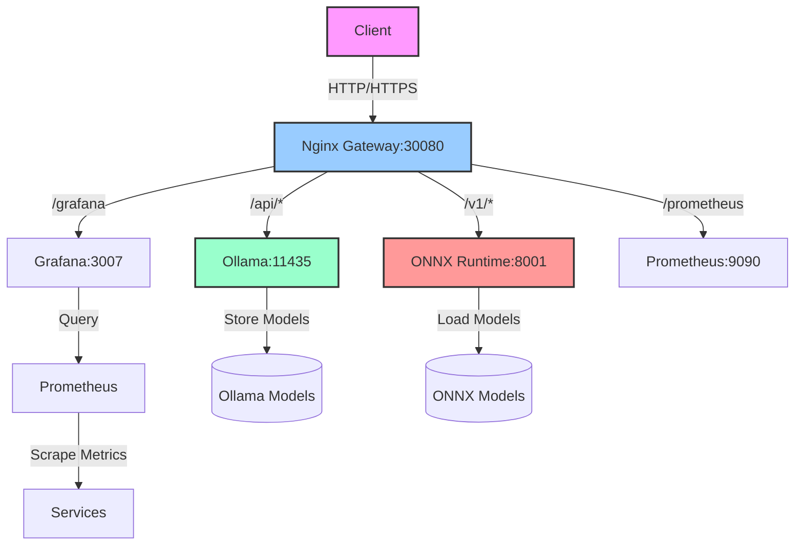
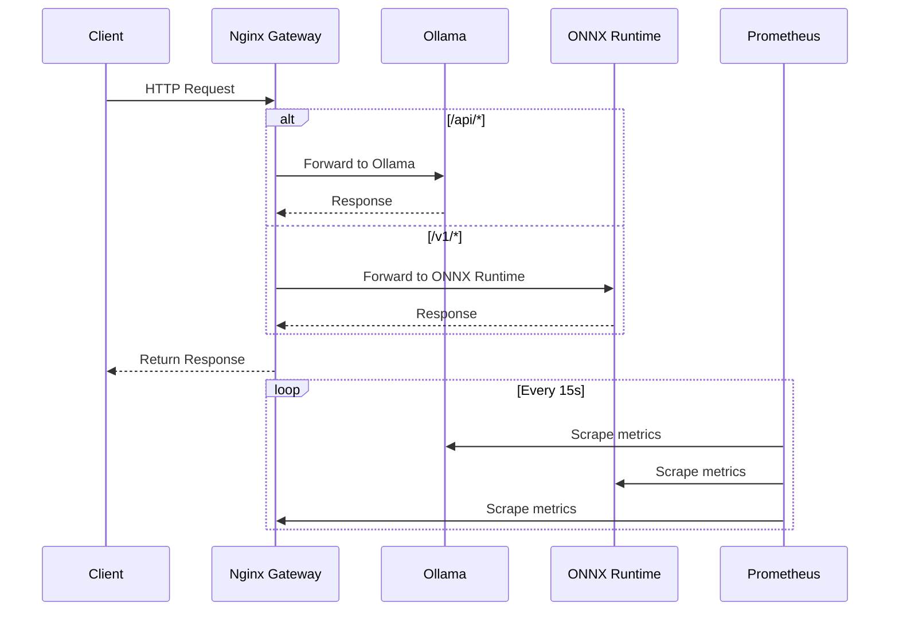

# Edge AI Platform Architecture

```
  _____      _      _____    ___   
 | ____|    / \    |_   _|  / _ \  
 |  _|     / _ \     | |   | | | | 
 | |___   / ___ \    | |   | |_| | 
 |_____| /_/   \_\   |_|    \___/  
  ___    _   _   _   _   _   _   _ 
 |_ _|  / \ | | | \ | | | | | | | |
  | |  / _ \| | |  \| | | | | | | |
  | | / ___ \ |_| |\  | |_| | |_| |
 |___/_/   \_\___/|_| \_|\___/ \___/ 
```

## System Architecture



## Component Details

### 1. Nginx Gateway
- **Port**: 30080
- **Role**: API Gateway and reverse proxy
- **Key Features**:
  - Request routing
  - Load balancing
  - SSL termination
  - Authentication/Authorization

### 2. Ollama Service
- **Port**: 11435 (mapped to 11435)
- **Role**: LLM serving
- **Compatibility**: OpenAI API compatible
- **Models**: Stored in `~/.ollama/models`

### 3. ONNX Runtime
- **Port**: 8001
- **Role**: ML model inference
- **Supported Models**: ONNX format
- **Model Location**: `./models` directory

### 4. Monitoring Stack

#### Prometheus
- **Port**: 9090
- **Role**: Metrics collection and alerting
- **Metrics**:
  - Container resource usage
  - API request rates
  - Model inference metrics

#### Grafana
- **Port**: 3007
- **Role**: Monitoring dashboards
- **Default Credentials**: admin/admin

## Data Flow



## Network Architecture

```
+------------------+       +------------------+       +------------------+
|                  |       |                  |       |                  |
|   Client         |<----->|   Nginx Gateway  |<----->|   AI Services    |
|  (Browser/App)   | 30080 |   (Reverse Proxy)|       |  (Ollama/ONNX)   |
|                  |       |                  |       |                  |
+------------------+       +------------------+       +------------------+
                                                             ^
                                                             |
                                                             v
                                                     +------------------+
                                                     |                  |
                                                     |   Monitoring    |
                                                     |  (Prometheus/    |
                                                     |   Grafana)       |
                                                     |                  |
                                                     +------------------+
```

## Security Considerations

- All services run in isolated Docker containers
- Internal network segmentation between services
- Authentication required for sensitive endpoints
- Rate limiting at the Nginx level
- TLS encryption for all external communications

## Scaling

The architecture is designed to scale horizontally:
- Multiple Ollama instances behind Nginx load balancer
- ONNX Runtime can be scaled based on demand
- Monitoring stack can be scaled for high availability

## High Availability

- Stateless services for easy scaling
- Persistent storage for model files
- Health checks and automatic recovery
- Monitoring and alerting for all critical components
