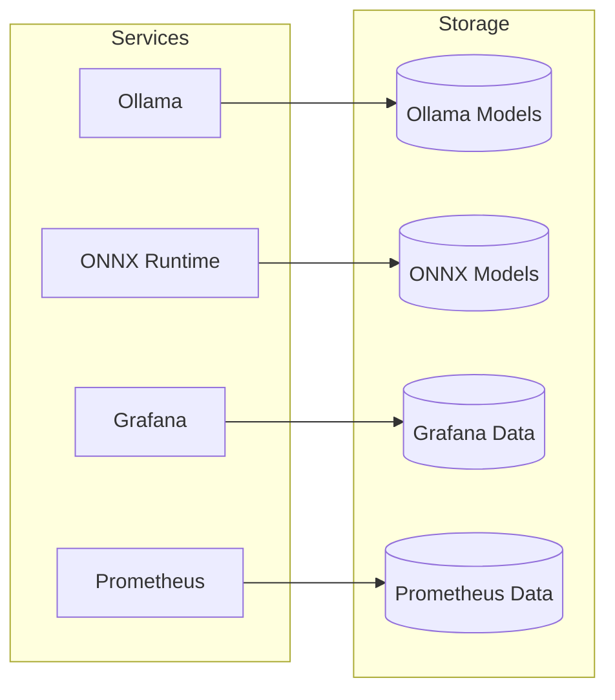

# 🚀 Deployment Guide

```
  ___           _                      _                   
 |   \ ___ _ _| |_ __ _ __ _ ___ _ _| |_ _  _ _ _  __ _ 
 | |) / -_) ' \  _/ _` / _` / -_) ' \  _| || | ' \/ _` |
 |___/\___|_||_\__\__,_\__, \___|_||_\__|\_,_|_||_\__,_|
                      |___/                               
  ___ _      _    _           _   _             
 | _ (_)__ _| |__| |_ _ _  __| |_(_)___ _ _  ___
 |  _/ / _` | '_ \ / _` | ' \/ _|  _| / _ \ ' \(_-<
 |_| |_\__,_|_.__/_\__,_|_||_\__|\__|_\___/_||_/__/
```

## 📋 Prerequisites

### System Requirements

```
┌─────────────────────┬─────────────────────────────────────────────┐
│ Component           │ Requirements                                │
├─────────────────────┼─────────────────────────────────────────────┤
│ CPU                 │ x86_64, 4+ cores                            │
│ Memory              │ 8GB+ (16GB recommended for LLM workloads)   │
│ Storage             │ 50GB+ free space                            │
│ OS                  │ Linux/macOS/Windows (Docker compatible)     │
│ Docker              │ 20.10+                                      │
│ Docker Compose      │ 2.0+                                        │
│ NVIDIA GPU (Opt)    │ CUDA 11.8+ with NVIDIA Container Toolkit    │
└─────────────────────┴─────────────────────────────────────────────┘
```

## 🛠️ Installation

### 1. Clone the Repository

```bash
git clone https://github.com/wronai/edge.git
cd edge
```

### 2. Configure Environment

Create a `.env` file with your configuration:

```bash
cp .env.example .env
# Edit the .env file as needed
```

## 🐳 Docker Deployment

### Development Mode

```bash
# Start all services
docker-compose up -d

# Verify services are running
docker-compose ps
```

### Production Deployment

1. Update `docker-compose.prod.yml` with your production settings
2. Deploy:
   ```bash
   docker-compose -f docker-compose.yml -f docker-compose.prod.yml up -d
   ```

## ☁️ Kubernetes Deployment

### Prerequisites

- Kubernetes cluster (v1.20+)
- `kubectl` configured
- `helm` (v3.0+)


### 1. Install NGINX Ingress Controller

```bash
helm repo add ingress-nginx https://kubernetes.github.io/ingress-nginx
helm install nginx-ingress ingress-nginx/ingress-nginx \
  --create-namespace \
  --namespace ingress-nginx \
  --set controller.publishService.enabled=true
```

### 2. Deploy Edge AI Platform

```bash
# Create namespace
kubectl create namespace edge-ai

# Deploy using kustomize
kubectl apply -k k8s/overlays/prod

# Check deployment status
kubectl -n edge-ai get all
```

## 🔧 Configuration

### Environment Variables

| Variable | Default | Description |
|----------|---------|-------------|
| `OLLAMA_HOST` | `0.0.0.0:11434` | Ollama server host and port |
| `OLLAMA_ORIGINS` | `*` | Allowed CORS origins |
| `ONNX_MODEL_PATH` | `/models` | Path to ONNX models |
| `PROMETHEUS_METRICS_PATH` | `/metrics` | Prometheus metrics endpoint |

### Persistent Volumes



## 🔄 Upgrading

### Docker Compose

```bash
# Pull latest images
docker-compose pull

# Recreate containers
docker-compose up -d --force-recreate
```

### Kubernetes

```bash
# Update the deployment
kubectl -n edge-ai rollout restart deployment

# Watch the rollout status
kubectl -n edge-ai rollout status deployment/edge-ai
```

## 🔒 Security

### Recommended Security Measures

1. **Enable Authentication**
   - Configure API gateway authentication
   - Use API keys or JWT tokens

2. **Network Security**
   - Restrict access to management interfaces
   - Use internal networks for service communication

3. **TLS/SSL**
   - Enable HTTPS for all endpoints
   - Use Let's Encrypt for free certificates

### Example Nginx Configuration

```nginx
server {
    listen 443 ssl;
    server_name ai.yourdomain.com;

    ssl_certificate /path/to/cert.pem;
    ssl_certificate_key /path/to/key.pem;

    location / {
        proxy_pass http://localhost:30080;
        proxy_http_version 1.1;
        proxy_set_header Upgrade $http_upgrade;
        proxy_set_header Connection 'upgrade';
        proxy_set_header Host $host;
        proxy_cache_bypass $http_upgrade;
        
        # Add authentication
        auth_basic "Restricted";
        auth_basic_user_file /etc/nginx/.htpasswd;
    }
}
```

## 📊 Monitoring and Logging

### Prometheus Configuration

Example `prometheus.yml`:

```yaml
global:
  scrape_interval: 15s

scrape_configs:
  - job_name: 'edge-ai-services'
    static_configs:
      - targets: ['ollama:11434', 'onnx-runtime:8001']
  - job_name: 'node'
    static_configs:
      - targets: ['node-exporter:9100']
```

### Log Management

```bash
# View logs for all services
docker-compose logs -f

# Follow specific service logs
docker-compose logs -f ollama

# View logs with timestamps
docker-compose logs -t
```

## 🧪 Testing the Deployment

### Smoke Tests

```bash
# Test API endpoints
./scripts/test-endpoints.sh

# Run integration tests
pytest tests/
```

### Load Testing

```bash
# Install k6
brew install k6  # macOS
# or
apt-get install k6  # Ubuntu/Debian

# Run load test
k6 run --vus 10 --duration 30s scripts/load-test.js
```

## 🔄 Backup and Recovery

### Backup Data

```bash
# Create backup directory
BACKUP_DIR="backups/$(date +%Y%m%d_%H%M%S)"
mkdir -p "$BACKUP_DIR"

# Backup volumes
docker run --rm -v ollama_data:/source -v "$(pwd)/$BACKUP_DIR":/backup \
  alpine tar czf /backup/ollama_backup.tar.gz -C /source .

# Backup configurations
cp -r config "$BACKUP_DIR/"
```

### Restore from Backup

```bash
# Stop services
docker-compose down

# Restore volume
docker run --rm -v ollama_data:/target -v "$(pwd)/backups/latest":/backup \
  alpine sh -c "rm -rf /target/* && tar xzf /backup/ollama_backup.tar.gz -C /target"

# Start services
docker-compose up -d
```

## 🚨 Troubleshooting

### Common Issues

1. **Port Conflicts**
   ```bash
   # Check used ports
   sudo lsof -i :30080,11435,8001,3007,9090
   ```

2. **Container Fails to Start**
   ```bash
   # Check container logs
   docker logs <container_name>
   
   # Check container status
   docker ps -a
   ```

3. **Insufficient Resources**
   ```bash
   # Check system resources
   docker stats
   
   # Increase resources in docker-compose.yml
   # under deploy.resources.limits
   ```

## 📞 Support

For additional help, please:
1. Check the [Troubleshooting Guide](#troubleshooting)
2. Search [GitHub Issues](https://github.com/wronai/edge/issues)
3. Open a new issue if you don't find a solution

## 📝 License

This project is licensed under the Apache Software License - see the [LICENSE](../LICENSE) file for details.
