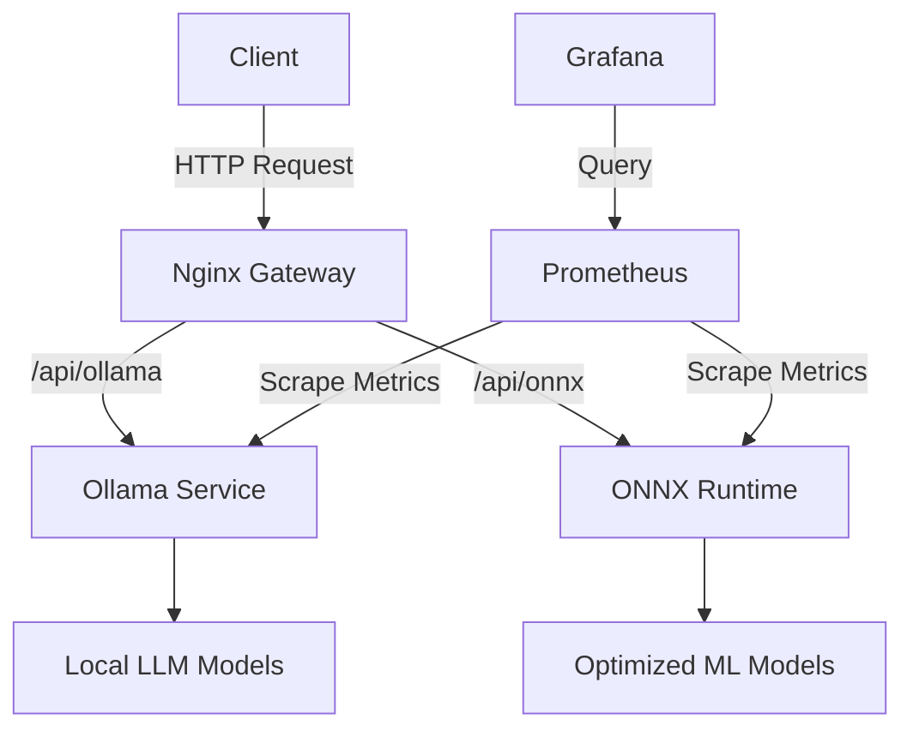

# Edge AI Platform Overview

## What is Edge AI Platform?

The Edge AI Platform is a comprehensive solution for deploying and managing AI models at the edge. It combines container orchestration, model serving, and monitoring into a single, easy-to-use platform.

## Key Components

### 1. Core Services
- **Ollama**: Local LLM server for running open-source language models
- **ONNX Runtime**: High-performance scoring engine for ML models
- **Nginx Gateway**: API gateway for routing requests to appropriate services

### 2. Monitoring Stack
- **Prometheus**: Metrics collection and storage
- **Grafana**: Visualization and dashboards
- **Node Exporter**: System metrics collection

### 3. Infrastructure
- **Docker**: Containerization
- **Kubernetes**: Container orchestration
- **Terraform**: Infrastructure as Code

## Architecture



## Getting Started

### Prerequisites
- Docker and Docker Compose
- 8GB+ RAM (16GB recommended)
- 20GB free disk space

### Quick Start
```bash
# Clone the repository
git clone https://github.com/wronai/edge.git
cd edge

# Start all services
make up

# Check service status
make status
```

## Next Steps
- [Explore Examples](/docs/examples/)
- [API Documentation](/docs/api/)
- [Deployment Guide](/docs/deployment/)
