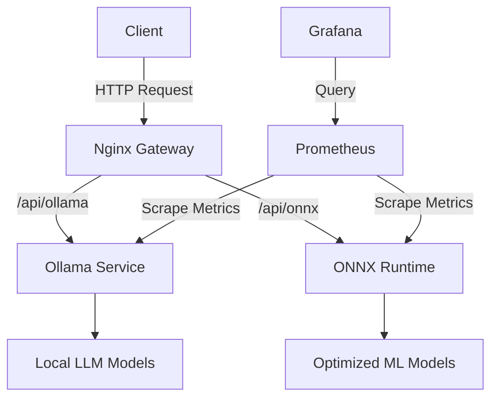
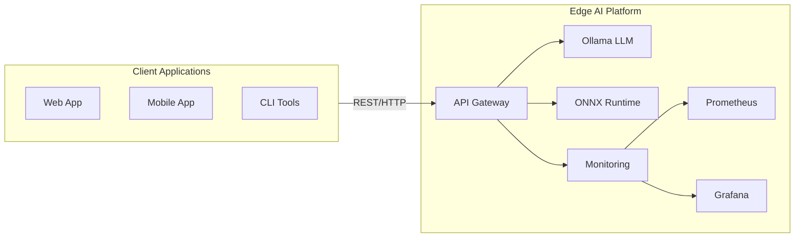
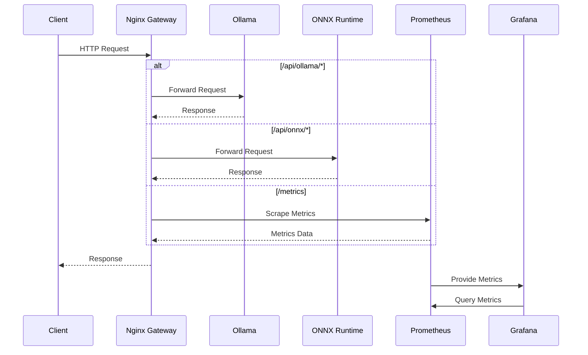

# Edge AI Platform Overview

## What is Edge AI Platform?

The Edge AI Platform is a comprehensive solution for deploying and managing AI models at the edge. It combines container orchestration, model serving, and monitoring into a single, easy-to-use platform.

## Key Components

### 1. Core Services
- **Ollama**: Local LLM server for running open-source language models
- **ONNX Runtime**: High-performance scoring engine for ML models
- **Nginx Gateway**: API gateway for routing requests to appropriate services

### 2. Monitoring Stack
- **Prometheus**: Metrics collection and storage
- **Grafana**: Visualization and dashboards
- **Node Exporter**: System metrics collection

### 3. Infrastructure
- **Docker**: Containerization
- **Kubernetes**: Container orchestration
- **Terraform**: Infrastructure as Code

## Architecture



## Getting Started

### Prerequisites
- Docker and Docker Compose
- 8GB+ RAM (16GB recommended)
- 20GB free disk space

### Quick Start
```bash
# Clone the repository
git clone https://github.com/wronai/edge.git
cd edge

# Start all services
make up

# Check service status
make status
```

## Next Steps
- [Explore Examples](/docs/examples/)
- [API Documentation](/docs/api/)
- [Deployment Guide](/docs/deployment/)

  _____      _      _____    ___   
 | ____|    / \    |_   _|  / _ \  
 |  _|     / _ \     | |   | | | | 
 | |___   / ___ \    | |   | |_| | 
 |_____| /_/   \_\   |_|    \___/  
  ___    _   _   _   _   _   _   _ 
 |_ _|  / \ | | | \ | | | | | | | |
  | |  / _ \| | |  \| | | | | | | |
  | | / ___ \ |_| |\  | |_| | |_| |
 |___/_/   \_\___/|_| \_|\___/ \___/ 
```

A production-ready AI/ML platform for edge computing with optimized model serving, monitoring, and scaling capabilities.

## 🏗️ System Architecture

### High-Level Overview



### Component Interaction



## 🚀 Quick Start

### Prerequisites

- Docker 20.10+
- Docker Compose 2.0+
- 8GB+ RAM (16GB recommended)
- 20GB+ free disk space

### Installation

1. Clone the repository:
   ```bash
   git clone https://github.com/wronai/edge.git
   cd edge
   ```

2. Start all services:
   ```bash
   # Start in detached mode
   make up
   
   # Or follow logs
   make up && make logs
   ```

3. Verify services are running:
   ```bash
   make status
   ```

## 🌐 Service Endpoints

| Service       | URL                          | Port  | Description                     |
|---------------|------------------------------|-------|---------------------------------|
| API Gateway  | http://localhost:30080       | 30080 | Main entry point                |
| Ollama API   | http://localhost:11435/docs  | 11435 | LLM API Documentation          |
| ONNX Runtime | http://localhost:8001/docs   | 8001  | ML Model Serving Documentation |
| Grafana      | http://localhost:3007        | 3007  | Monitoring Dashboards           |
| Prometheus   | http://localhost:9090        | 9090  | Metrics Collection             |

## 🔄 Common Workflows

### Model Deployment

1. **Ollama Models**
   ```bash
   # Pull a model
   curl http://localhost:11435/api/pull -d '{"name": "llama2"}'
   
   # List available models
   curl http://localhost:11435/api/tags
   ```

2. **ONNX Models**
   ```bash
   # Place your .onnx model in the models/ directory
   # The service will automatically detect new models
   ```

### Monitoring and Logs

```bash
# View logs for all services
make logs

# View specific service logs
make ollama-logs
make onnx-logs
make nginx-logs

# Access monitoring dashboards
make monitor
```

## 🛠️ Troubleshooting

### Common Issues

1. **Port Conflicts**
   ```bash
   # Check for processes using the ports
   sudo lsof -i :30080,11435,8001,3007,9090
   
   # Or use netstat
   sudo netstat -tulpn | grep -E '30080|11435|8001|3007|9090'
   ```

2. **Container Issues**
   ```bash
   # Check container status
   docker ps -a
   
   # View container logs
   docker logs wronai_edge-ollama
   docker logs wronai_edge-onnx
   ```

3. **Cleanup**
   ```bash
   # Stop and remove all containers
   make clean
   
   # Remove all unused Docker resources
   make docker-prune
   ```

## 📚 Documentation Index

- [Examples](/docs/examples/)
  - [Ollama LLM](/docs/examples/ollama-basic.md)
  - [ONNX Runtime](/docs/examples/onnx-basic.md)
- [API Reference](#) (Coming Soon)
- [Deployment Guide](#) (Coming Soon)
- [Monitoring Guide](#) (Coming Soon)

## 🤝 Contributing

Contributions are welcome! Please read our [Contributing Guidelines](CONTRIBUTING.md) for details.

## 📄 License

This project is licensed under the MIT License - see the [LICENSE](LICENSE) file for details.
